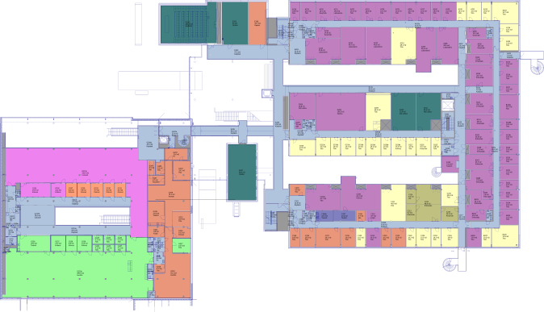

# Map Processing

Indoor map processing has several steps:

1. Polish and simplify the indoor map
2. Produce a georeferenced raster file (TIFF file generation)
3. ...

## 1. Polish and simplify the indoor map

The starting point should be an indoor map, which is preferably in vector format. In principle, a raster file should suffice as well, but the problem is that it should have very high resolution (up to 10k x 10k pixels). Here, we'll assume that the original indoor map is a SVG vector file.

The first step is to polish the vector file. We used [Inkscape](http://inkscape.org) which is freely available. Our initial map looked like this:

This map was simplified by removing non-essential information. Also, the color scheme was simplified so that most areas use only two different shades of gray. After processing, the map looked like this:

Once the map has been polished, it should be exported as a PNG file. We recommend exporting the PNG with a resolution of *288 dpi*. In our case, this gave a PNG file which was about 10k x 5k pixels.

## 2. Produce a georeferenced raster file (TIFF file generation)

The second step is georeferencing. The purpose of georeferencing is to assign geographic coordinates to our raster image, so that it may be overlayed on top of a map. Here, we'll use [QGIS](http://qgis.org) which is freely available.
